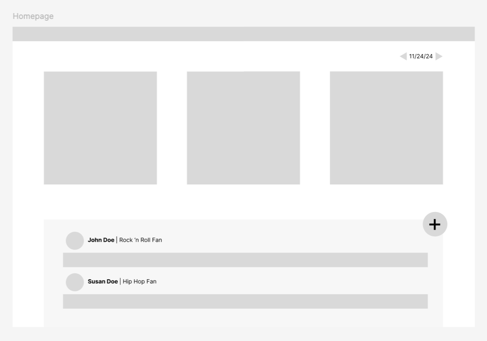

# Impact Team Technical Assessment Spring 2025
An assessment on a candidates ability to create a full-stack web app using React.js + Node.js OR Flask.

By <b>December 5th at 11:59pm</b> you must fork this repository and submit a PR (pull request) to this repository with your completed version of the app. 

## 📝 Summary
Create an app that acts as a music review community board. Everyday your app will randomly pick 3 songs  for people to listen to and talk about in a discussion board below.
This will not require user authentication, but will require a database and use of the [Genius API](https://docs.genius.com/#/getting-started-h1).

*This is an example of what the app could look like. Designed by Owen in Figma and linked below*

## 🗂️ Requirements
1. Use a JS framework
    - If using React **don't use `create-react-app`** because it is deprecated
2. Use a UI library (it will make it much easier on you)
3. Query the Genius [api endpoint](https://docs.genius.com/#/getting-started-h1) and display 3 random songs in cards (with relevant info)
    - You will need to find a valid range of IDs for songs when randomizing. Play around with the API a bit to see if you find a pattern and keep retrying the fetch until you get 3 songs. You can leverage response codes to know if it was successful or not
4. Have a backend to store the comments you get everyday and the songs that day 
5. Have function to be able to go back to previous days to see the songs/discussion then

## 🎖️ Bonuses
- Deploy your application (frontend, backend, and database) so that it is able to be interacted with online. Attach link to your submission
- If someone makes a comment using the same name multiple times, put a checkmark next to their name showing they contribute a lot
- Add a "vote" function to the form where they add a comment for which of the 3 they liked the most. At the end of the day (according to Coordinated Universal Time -- or UTC) identify a song as the "winner" and show that it won if people ever go back to check previous days

## 📚 Resources 
[**Figma Mockup**](https://www.figma.com/design/LSIE24Q1A7bMFEKeF5hLOE/Music-Discussion-Board?node-id=0-1&node-type=canvas&t=WKB5W38IIXPkSHsx-0): use this for inspiration for what the app could look like. It doesn't need to look like this if you don't want it to however.

[**Genius API Endpoint**](https://docs.genius.com/#/getting-started-h1): You will need to use this to get the songs / info about the song / image of song

[**Deployment Tutorial**](): TO BE ADDED. You don't necessarily need to use these technologies but they are outlined here. Consider using
- Heroku for backend
- Netlify / Vercel for frontend
- RDS from AWS

**UI Libraries**: Help with cohesive design. Look into MUI / Ant Design / others

## 🤖 LLM Usage
Using LLMs for code assistance is allowed but you WILL be asked questions about your code in the interview (if invited) so you should be very comfortable with the purpose of the code.

## 🤝 Submission
In order for your code to be assessed you must submit a PR by December 5th at 11:59pm with the following
- runnable code (except the database stuff because you shouldn't have your connection uri's on github)
- a screenrecording of your code working and you explaining how you did it
- a couple sentences about how the project went
- what you would change about this assessment for next year 

** **YOU DO NOT NEED TO HAVE A 100% COMPLETE PROJECT TO SUBMIT. Please submit whatever you are able to make** **